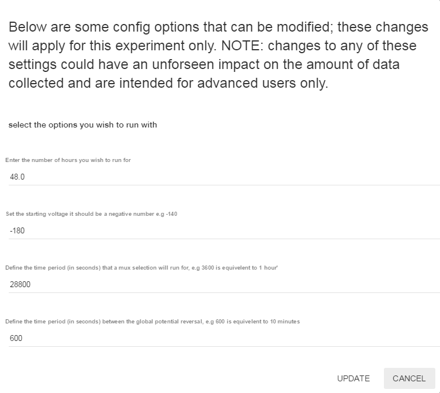
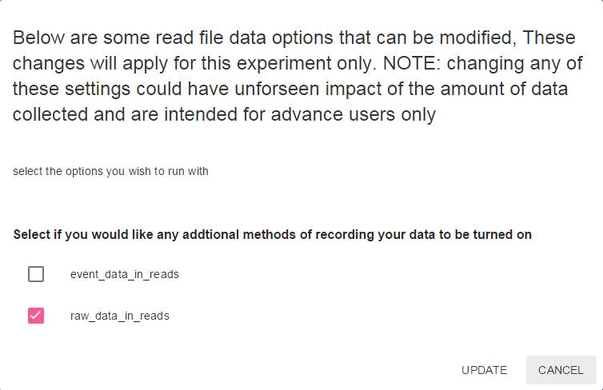
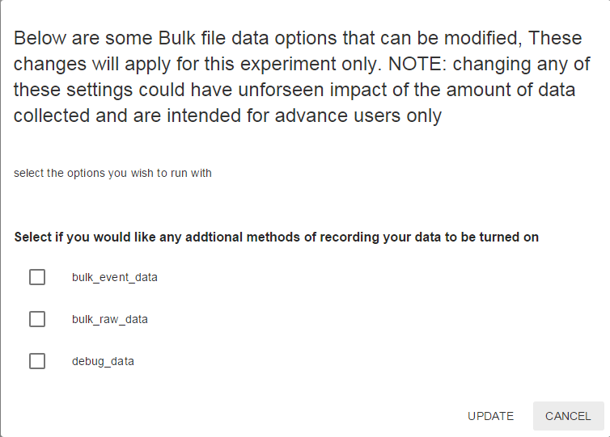

########################
Editing Protocol Scripts
########################

.. container:: custom-warn

    This page is a copy of the `Nanopore Community Knowledge Page <https://community.nanoporetech.com/protocols/experiment-companion-minknow/v/mke_1013_v1_revaj_11apr2016/editing-protocol-scripts>`_.
    Please use the latest instructions available on the Community pages.

Introduction
============

In MinKNOW version 0.51.3 onwards, the protocol scripts are structured in a way that makes it
easier for users to configure certain parameters, without needing extensive programming knowledge.
Namely, there are three settings that can be configured for the 48 h runs from the scripts:

run_time_changes allows the user to change:

- the total run time in hours
- the time in seconds between MUX changes
- the starting voltage of the run
- the time in seconds between global potential reversals

If this configuration is not enabled, the run starts with the current default settings.

read_file_configuration allows the user to:

- turn raw data for reads on or off
- turn event data for reads on or off

bulk_file_configuration allows the user to:

- turn raw data on in the bulk file
- turn event data on in the bulk file

Note on editing MinKNOW scripts
-------------------------------

Prerequisites

Changing the settings of the scripts impacts on the data collected during the run, so it is advised
that such configuration is attempted by advanced users only.

A note of caution

The scripts that control the device, particularly the sequencing run scripts, are an area of constant
development. Scripts are subject to rapid change and can be added, removed and overwritten by the
automatic software updates from Oxford Nanopore. Consequently, it is highly recommended that copies
of altered scripts are saved in a second location, with change notes, so that if necessary they can
be restored quickly.

Open the script of interest
===========================

Open a text editor software (e.g. Notepad++) with Administrator privileges
In the text editor, click Open and navigate to:

``C:\Program Files\OxfordNanopore\MinKNOW\ont-python\Lib\site-packages\bream\core\nc\cli\NC_Sequencing.py`` in Windows

``Applications/MinKNOW.app/Contents/Resources/ont-python/lib/python2.7/site-packages/bream/core/nc/cli/NC_Sequencing.py`` in Mac OS X

``/opt/ONT/MinKNOW/ont-python/lib/python2.7/site-packages/bream/core/nc/cli`` in Linux

Navigate to
===========

navigate to line 349:
``popup_boxes=args.popup_boxes``

Replace
=======

Replace this line with any combination of the three options below::

    'run_time_changes'
    'read_file_configuration'
    'bulk_file_configuration'

For example, to enable all three, type::

    popup_boxes=['run_time_changes', 'read_file_configuration', 'bulk_file_configuration'],

**Note: the comma at the end of the line is essential for the script to function properly.**

Save the script
===============

Restart the MinKNOW service
===========================

Open up a command prompt window as administrator, and navigate to the MinKNOW folder::

    cd "Program Files\OxfordNanopore\MinKNOW"
    bin\mk_manager_client.exe --exit
    bin\mk_manager_svc.exe

For Mac OS X users, open a terminal window::

    cd /Applications/MinKNOW.app/Contents/Resources
    sudo bin/mk_manager_svc

For Ubuntu users, open a terminal window::

    cd /opt/ONT/MinKNOW
    sudo bin/mk_manager_svc

Pop-up box
==========

After the relevant lines in the script have been activated, a pop-up box will appear when a 48 h
protocol is selected in the MinKNOW web GUI. Enter or check the appropriate information and click Update.

    run_time_changes

    read_file_configuration

    bulk_file_configuration

**Bulk data acquisition is turned off by default; to enable it, check the
debug_data box in addition to either the event or raw data.**