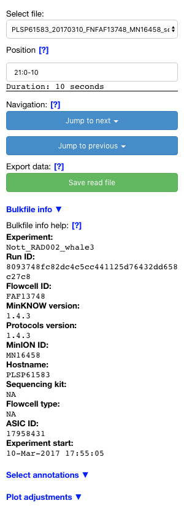

##########
Quickstart
##########

This page will provide a quick overview of the bulkvis features and how to use them.

Start bulkvis
=============
From the directory containing bulkvis, run::

    bokeh serve --show bulkvis

This will start the bulkvis app and open the page in your default web browser. The page should look like this:

    Screenshot of bulkvis on initial load

Selecting a bulk-fast5-file
===========================
Use the drop-down to select a bulk-fast5-file from your supplied directory. Once the file is loaded the position can be
entered.

    Screenshot of bulkvis waiting for position information

Selecting a position
====================
The position can be selected by either supplying coordinates or a fastq read header. The contents of this input is submitted
by clicking away from the text box or by pressing return/enter. If bulkvis cannot parse the input the text box will turn
red until valid input is detected.

After a position is entered bulkvis will completely load and the chart will be visible.

Using coordinates
-----------------
Coordinates refer to the channel, start time and end time. This is given in the format ``channel:start-end``. For
example to navigate to channel 42 and see the squiggle from 30 seconds to 90 seconds::

    42:30-90

Using a fastq read header
-------------------------
Alternatively, the position can be given as a fastq read header that is from the run associated with this bulk-fast5-file.
This can be copied and pasted into the text-box e.g::

    @b45a4b09-6f22-40f6-afd9-aa7fca8e89f3 runid=f9291b45b0c66faa77755e51738d193fcfafffc7 read=234 ch=391 start_time=2018-01-18T21:59:40Z

After entering valid input the chart and other elements will load:

    Screenshot of bulkvis fully loaded with both plot and sidebar

Navigating
==========
The bulk-fast5-file can be navigated by jumping to the next or previous event and by using the xpan (|xpan_icon|) to drag
the plot along the x-axis or zoom (|zoom_icon|) to take a closer look at a section of the plot.

The jump to action is available for any event type that is listed as ``True`` in config.ini and is available even when the
event is not currently being displayed.

Bulkfile information
====================
The bulkfile information panel showcases information that is present in the bulk-fast5-file that is not necessarily
displayed in MinKNOW.

    Screenshot of bulkvis sidebar

Annotations
===========
Annotations are added to the plot based on state data and intermediate data from the bulkfile. These represent the label
computed by MinKNOW at specific time points in the experiment.

Selecting a checkbox will allow that specific label to be rendered on the plot. The 'Display annotations' button will toggle
all annotations on/off.

    Screenshot of the annotation selection panel

Plot adjustments
================
The plot adjustments are infrequently used options that are for tweaking the appearance of the plot without having to modify the configuration file.
Here the width and height of the plot can be set to match the current screen, the height that annotations are rendered at can be adjusted, and the Y-axis can
be fixed to a given range.

Plot smoothing is on by default, as raw signal data can quickly become massive, this reduces the number of points plot but maintains the shape of the data.
Smoothing will automatically turn on whenever the position is changed.

    Screenshot of the plot adjustments panel

Exporting images
================
bulkvis is able to export images of plots as below, this is done using the save function (|save_icon|) which will either download
the current plot view as ``bokeh_plot.png`` or, in safari, open the image in a new tab where it can be saved by right clicking and selecting save.

    Example plot from bulkvis

Exporting read files
====================
bulkvis is able to export arbitrary read files from bulk-fast5-files. The data range is determined by the current position as set in the text input.
When a read file is generated it is written to the folder set in the configuration file.

    Screenshot of export button and success message (below 'duration')

.. |zoom_icon| image:: /_static/icons/zoom.png
    :height: 11pt
.. |xpan_icon| image:: /_static/icons/xpan.png
    :height: 11pt
.. |save_icon| image:: /_static/icons/save.png
    :height: 11pt