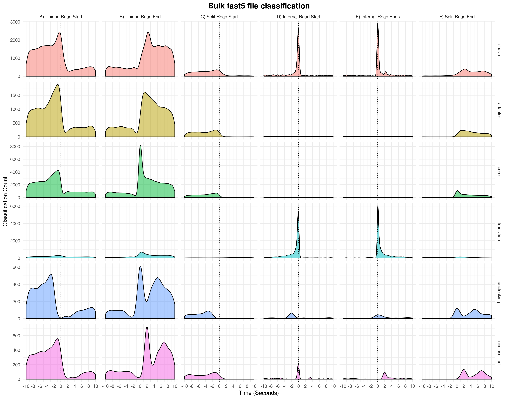

Utilities
=========

An overview of the utility scripts provided to conduct analysis on fused reads.

whale_watch.py
--------------
.. code-block:: bash

    Parse sequencing_summary.txt files and .paf files to find split reads in an
    Oxford Nanopore Dataset

    General options:
      -h, --help         Show this help and exit
      -d , --distance    Specify the maximum distance between consecutive
                         mappings. This is the difference between 'Target Start'
                         and 'Target End' in the paf file. Defaults to 10000
      -t , --top         Specify how many top processed reads to display. Default
                         is 10
      -D, --debug        Write debug file

    Input sources:
      -s , --summary     A sequencing summary file generated by albacore
      -p , --paf         A paf file generated by minimap2

    Output files:
      -F , --out-fused   Specify name of the fused_read file. This file only
                         contains chains of reads. Defaults to 'fused_reads.txt'

Output format
^^^^^^^^^^^^^
.. csv-table::
    :header: "Field", "Description", "Example"

    "coords", "bulkvis position coordinates", "231:30782-32296"
    "run_id", "The run that these reads came from", "8093748fc82dc4c5cc441125d76432dd658c27c8"
    "channel", "Channel that sequenced these reads", "231"
    "start_time", "Time, in seconds, that the (first) incorrectly split read starting sequencing", "30782.8425"
    "duration", "Time, in seconds, it took for the incorrectly split read to pass through the channel", "1512.46425"
    "combined_length", "Number of bases in the combined reads", "611531"
    "target_name", "The mapping target, determined by minimap", "chr7"
    "strand", "'+' if query and target on the same strand; '-' if opposite", "\+"
    "start_match", "Start coordinate on the original strand", "46731340"
    "end_match", "End coordinate on the original strand", "46791591"
    "cat_read_id", "Read ids of all the reads in this group", "82eed45a-7774-4778-8f8a-eb17d7010116|6e9c7720-b7a3-47cc-8f42-30e2219add4b"
    "count", "Number of reads in this group", "2"

whale_merge.py
--------------
.. code-block:: bash

    Parse sequencing_summary.txt files and .paf files to find chained reads in an
    Oxford Nanopore Dataset and output fused fastq files

    General options:
      -h, --help         Show this help and exit
      -d , --distance    Specify the maximum distance between consecutive
                         mappings. This is the difference between 'Target Start'
                         and 'Target End' in the paf file. Defaults to 10000

    Input sources:
      -s , --summary     A sequencing summary file generated by albacore
      -p , --paf         A paf file generated by minimap2
      -f , --readfiles   Full path to the folder containing fastq files you wish
                         to join

    Output files:
      -o , --out-fused   Specify name of the fused_read fastq file. This file will
                         contain fused reads and the remaining singleton reads.
                         Defaults to 'fused_reads.fastq'
      -W                 Outputs just the fused reads

set_config.py
-------------
.. code-block:: bash

    Generate a configuration file required for bulkvis to run

    General options:
      -h, --help          Show this help and exit

    Input sources:
      -b , --bulkfile     A bulk-fast5 file to get labels from
      -i , --input-dir    The path to tbe folder containing bulk-files for
                          visualisation
      -e , --export-dir   The path to tbe folder where read-files will be written
                          by bulkvis

    Output:
      -c , --config       Path to the config.ini file in your bulkvis installation

Figure scripts
--------------
whale_plot.py
^^^^^^^^^^^^^
.. code-block:: bash

    Parse sequencing_summary.txt, .paf, and bulk fast5 files to generate
    distribution files for creating classification figures in R.

    General options:
      -h, --help            Show this help and exit
      -d DISTANCE, --distance DISTANCE
                            Specify the maximum distance between consecutive
                            mappings. This is the difference between 'Target
                            Start' and 'Target End' in the paf file. Defaults to
                            10000
      -V, --verbose         Print verbose output to terminal

    Input sources:
      -b BULK_FILE, --bulk-file BULK_FILE
                            An ONT bulk fast5 file containing raw signal
      -s SUMMARY, --summary SUMMARY
                            A sequencing summary file generated by albacore
      -p PAF, --paf PAF     A paf file generated by minimap2
      -t TIME, --time TIME  +/- time around a strand event, default is 10 seconds

    Output files:
      -g, --generate-plot   If set, do not generate density plot
      -A A                  Column A time distributions as CSV
      -B B                  Column B time distributions as CSV
      -C C                  Column C time distributions as CSV
      -D D                  Column D time distributions as CSV
      -E E                  Column E time distributions as CSV
      -F F                  Column F time distributions as CSV
      -o OUT, --out OUT     Specify the output filename for the plot, defaults to
                            'classification_count.pdf'. Filetype must be one of
                            [.eps, .ps, .tex, .pdf, .jpeg, .tiff, .png, .bmp,
                            .svg, .wmf]

Example plot:
"""""""""""""
.

    Example plot from whale_plot.py

pod_plot.py
^^^^^^^^^^^
.. code-block:: bash

    Generate plots for all reads in a fused_reads.txt file. This uses bokeh to
    render a plot and requires selenium, phantomjs, and Pillow to be installed.
    These are available via conda/pip.

    General options:
      -h, --help         Show this help and exit

    Input sources:
      -f , --fused       A fused read file generated by whale_watch.py
      -b , --bulk-file   An ONT bulk-fast5-file

    Output files:
      -D , --out-dir     Specify the output directory where plots will be saved.
                         Defaults to current working directory

4.1.1
"""""
4.1.1

